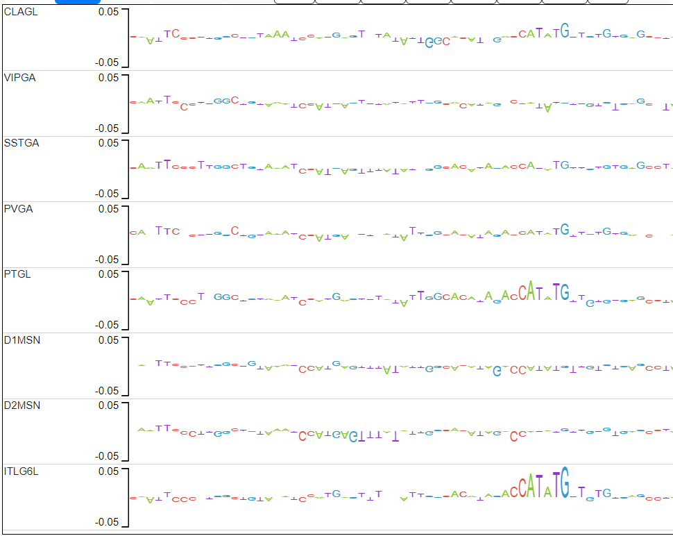
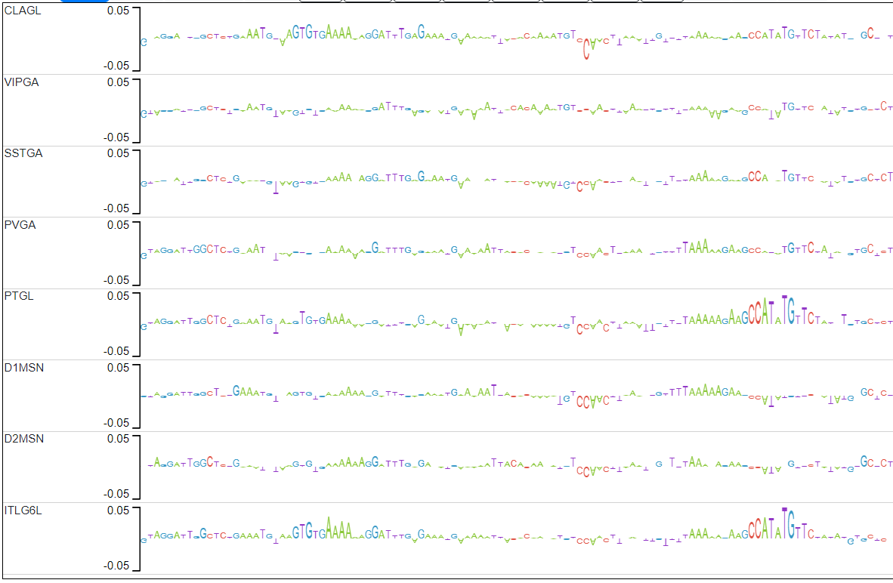
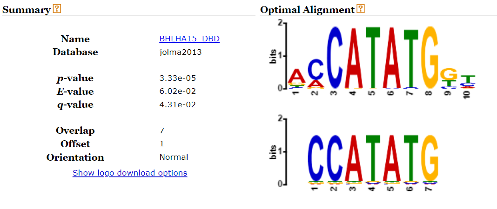

# Sequence priorization

### The problem

The goal is to find subsequences of mouse DNA which impact chromatin accessibility significantly in one cell type, but have little or none impact in other cell types. In other words, we are looking for cell-type specific motifs that potentially play a role in gene expression and regulation.

### The plan

- 1. Train SVMs on chromatin accesibility data on 10 different mouse cell types.

- 2. Evaluate performance of the trained models.
If the models are not *good* enough go back to step 1.

- 3. For each SVM, compute explain scores (contribution to model's output at basepair resolution).

- 4. Find subsequences where the explain scores of one model are relatively large and differ significantly from the explain scores of the models trained on the other cell types. 

- 5. Check if the subsequences found match a known motif (using [TomTom](https://meme-suite.org/meme/tools/tomtom)) and create a list of candidate subsequences.

### The assumption

We are assuming that explain scores (defined as the predictive contribution of every nucleotide in an input DNA sequence to its associated output label through the lens of a gkm-SVM model) **accurately** reflect the effect on chromatin accesibility each base-pair has.

More information on how explain scores are computed can be found in the [original paper](https://academic.oup.com/bioinformatics/article/35/14/i173/5529147).

The C package [lsgkm](https://github.com/kundajelab/lsgkm) was used to train the SVMs.

### What's this notebook?

Steps 1, 2 and 3 have already been completed, this jupyter notebook corresponds to step 4 and 5: analyzing/comparing explain scores.

We now compute the similarity (distance) between the explain scores of the model trained on ITL6GL data and the rest of the models at each peak.

We are using the *max sliding window difference* distance function. This distance measure is defined in the following way:

$$
d(\mathbf{x},\mathbf{y}) = max_{i = 1,...,N-w \\  w \in \mathbf{N}} { ||\mathbf{x}[i:i+w] - \mathbf{y}[i:i+w]||^2 \; }
$$

Basically this splits the peak in overlapping subsequences of length $w$, computes the L2 distance between each pair of subsequences, and takes the max of those distances. 

*Why this distance function?* We want to check if there exists a subsequence which differs significantly. Thus, global similarity measures may not always suitable. The main drawback of this distance is that the parameter $w$ needs to be tuned. The bigger $w$, the longer the motifs that are captured.

### ITL6GL (Excitatory neurons) specific peaks analysis

-------------------------------------------------------------------------------------------------------------------------------
-------------------------------------------------------------------------------------------------------------------------------

The candidate peaks are those in which the average distance between the explain scores of the ITL6GL model and the explain scores of the rest of the models is in the top 2% (above red line). 

###### Our candidates for ITL6GL specificity

#### Candidates ITL6GL

