# Sequence priorization

  

## The problem

The goal is to find subsequences of mouse DNA which impact chromatin accessibility significantly in one cell type, but have little or none impact in other cell types. In other words, we are looking for cell-type specific motifs that potentially play a role in gene expression and regulation.

## The plan

- 1. Train SVMs (nonlinear gapped k-mer SVMS to be precise) on chromatin accesibility data on 10 different mouse cell types.

- 2. Evaluate performance of the trained models.
If the models are not *good* enough go back to step 1.

- 3. For each SVM, compute explain scores (contribution to model's output at basepair resolution).

- 4. Find subsequences where the explain scores of one model are relatively large and differ significantly from the explain scores of the models trained on the other cell types. 

- 5. Check if the subsequences found match a known motif (using [TomTom](https://meme-suite.org/meme/tools/tomtom)) and create a list of candidate subsequences.

## The assumption

We are assuming that explain scores (defined as the predictive contribution of every nucleotide in an input DNA sequence to its associated output label through the lens of a gkm-SVM model) **accurately** reflect the effect on chromatin accesibility each base-pair has.

More information on how explain scores are computed can be found in the [original paper](https://academic.oup.com/bioinformatics/article/35/14/i173/5529147).

The C package [lsgkm](https://github.com/kundajelab/lsgkm) was used to train the SVMs. Go to the [KundajeLab lsgkm repo](https://github.com/kundajelab/lsgkm) in order to install it (you will need it if you want to train the models or compute more explain scores).

## How to measure distance between explain scores at peak regions?

  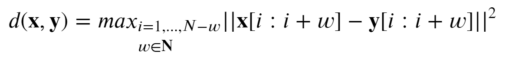

Basically this splits the peak in overlapping subsequences of length w, computes the L2 distance between each pair of subsequences, and takes the max of those distances. 

*Why this distance function?* We want to check if there exists a subsequence which differs significantly. Thus, global similarity measures may not always suitable. The main drawback of this distance is that the parameter w needs to be tuned. If w is too small, spurious motifs may be captured, and if w is too large, most short motifs are missed.

The values chosen for were 8, 13 and 20.

### Cell Types

The cell types of interest are: CLAGL, D1MSN, D2MSN, ITL6GL, NPGL, PTGL, PVGA, SSTGA, VIPGA.
You can find more about the properties of these cell types in the [CATLAS](http://catlas.org/mousebrain/#!/cellType). 

## What's in this repository?

- The scripts for Steps 1, 2 and 3. (Which is a modified version of [SVM pipeline repo](https://github.com/kundajelab/SVM_pipelines).)
- The python modules for Steps 4 and 5.
- Jupyter notebooks for illustration and analysis of the results.

-------------------------------------------------------------------------------------------------------------------------------
-------------------------------------------------------------------------------------------------------------------------------

## Examples

### ITL6GL 

The candidate peaks are those in which the average distance between the explain scores of the ITL6GL model and the explain scores of the rest of the models is in the top 2% (above red line). 

### Our candidates for ITL6GL specificity

  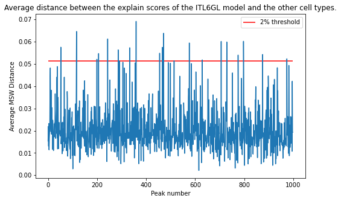

  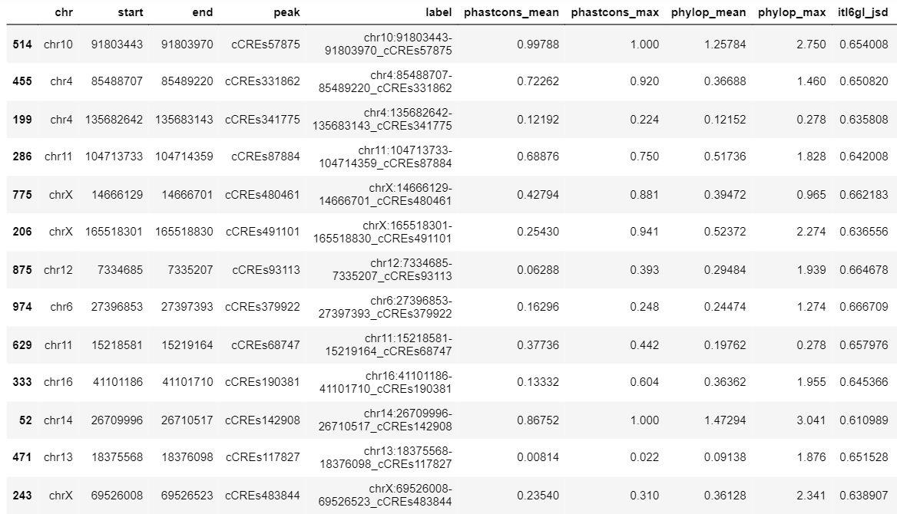

### Closer look at the peaks

-------------------------------------------------------------------------------------------------------------------------------

### CLAGL

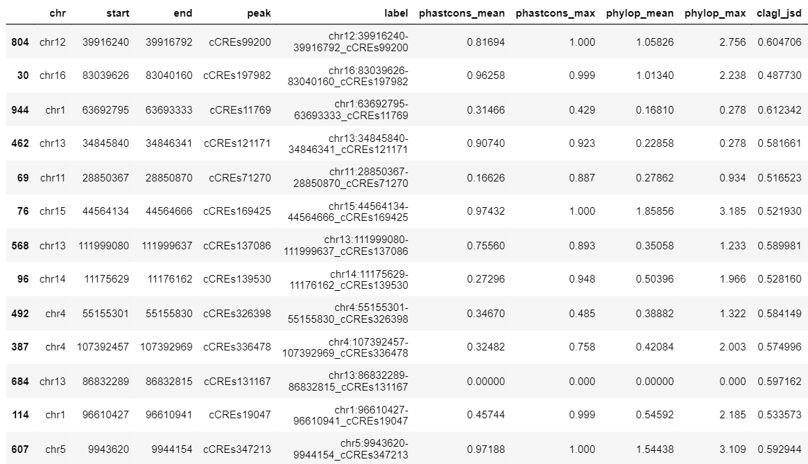

Candidate 1 actually has 2 examples of motifs that pop up only in CLAGL.

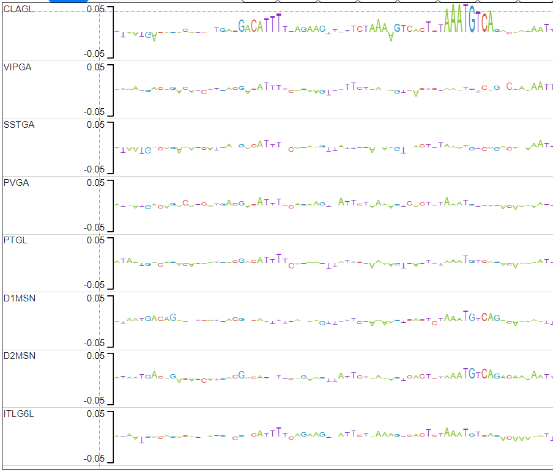

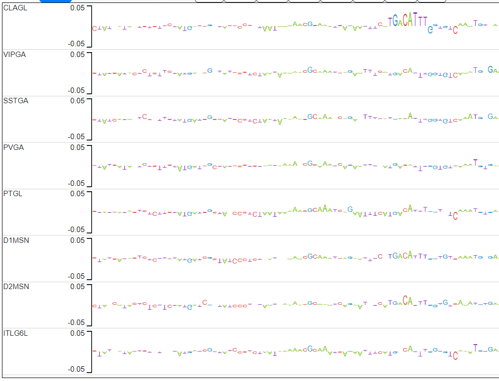

Looking up the second candidate motif (TGACATTT) in TOM TOM yields the following match in mouse DNA:

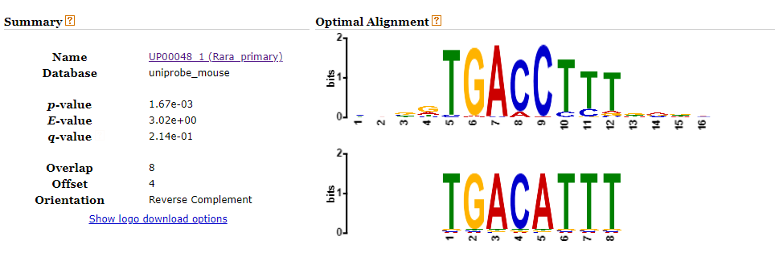

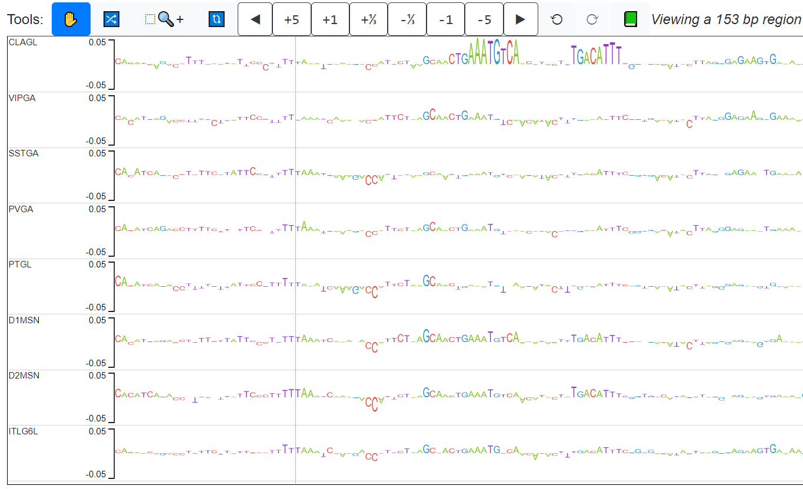

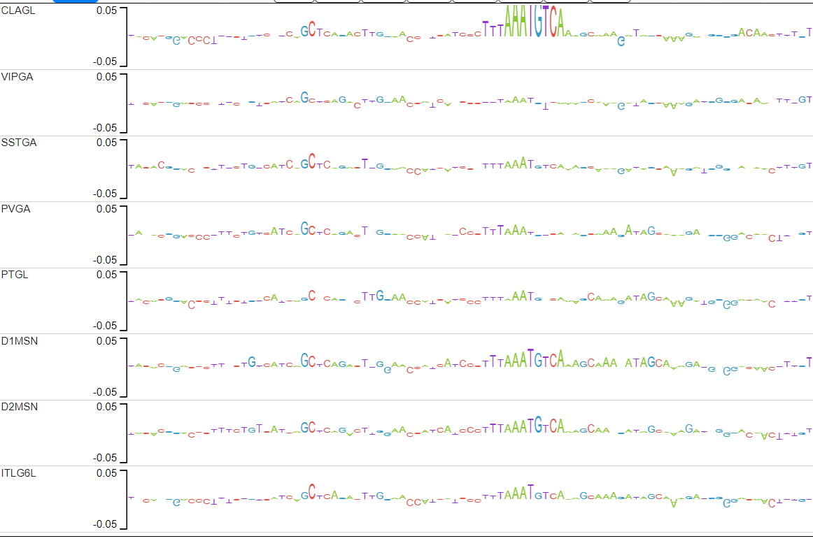

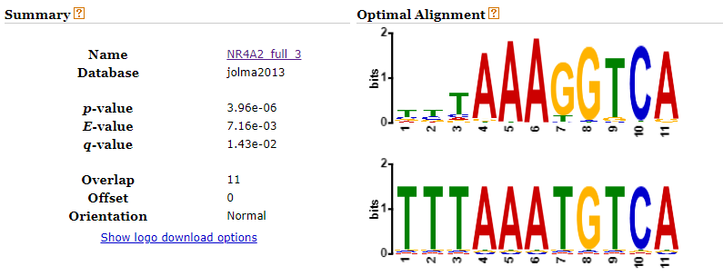

-------------------------------------------------------------------------------------------------------------------------------

### Group behaviour

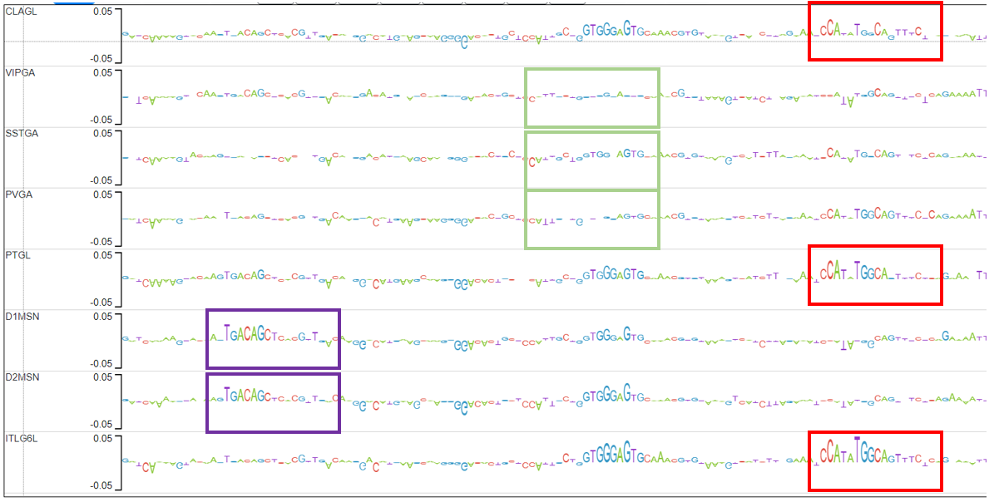

